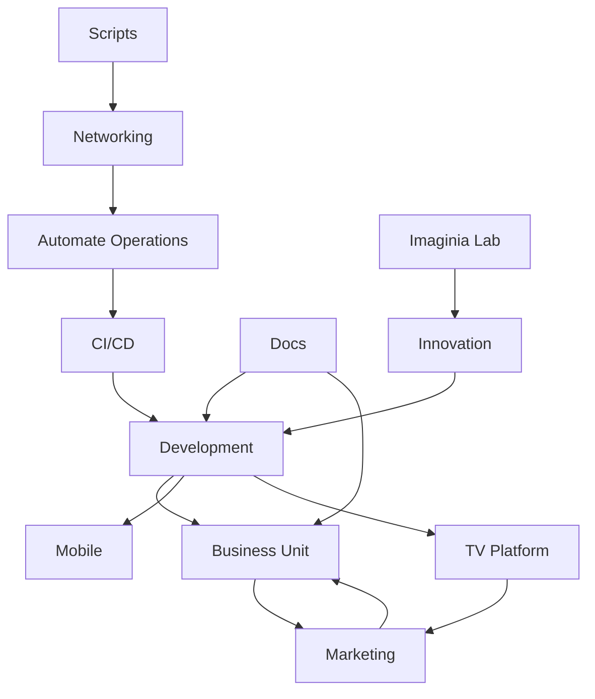

# CENTRAL-HUB

Welcome to the CENTRAL-HUB repository — your organization’s unified monorepo for all key areas and initiatives.

## 🚀 Vision & Purpose

CENTRAL-HUB is designed to bring together every major department and project into a single, well-organized repository. This approach fosters collaboration, transparency, and efficiency across the entire organization.

## 🌐 Why a Monorepo?
- **Collaboration:** Break down silos and enable cross-team synergy.
- **Maintainability:** Centralized updates and shared resources.
- **Scalability:** Easily add new areas or projects as your organization grows.
- **Visibility:** Everyone can see and contribute to the bigger picture.

## 🏢 Organizational Areas Mapped
Each top-level folder represents a core area of your organization:

- **automate-operations:** Automation, Ansible, Terraform
- **business-unit:** Dashboards, Strategy Docs
- **ci-cd:** GitHub Actions, Jenkins Pipelines
- **development:** Backend, Web
- **docs:** Architecture, Documentation
- **imaginia-lab:** AI Experiments, Quantum
- **innovation:** Prototypes, Research
- **marketing:** Analytics, Campaigns
- **mobile:** Android, iOS
- **networking:** Automation, SDN
- **scripts:** Monitoring and utilities
- **tv-platform:** Streaming, UX

## 🗺️ 2D Organization Map
Below is a 2D map of the organization’s areas and their relationships:



## 📁 Folder Structure Example

```text
CENTRAL-HUB/
├── automate-operations/
├── business-unit/
├── ci-cd/
├── development/
├── docs/
├── imaginia-lab/
├── innovation/
├── marketing/
├── mobile/
├── networking/
├── scripts/
└── tv-platform/
```

## ⚡ Quick Start Guide
1. **Browse Areas:** Explore folders to find resources for each department.
2. **Contribute:** Follow area-specific README.md files for contribution guidelines.
3. **Discover:** Use the organization map to understand relationships and workflows.

## 📚 Useful Links & Documentation
- [Internal Docs](docs/README.md)
- [Architecture Overview](docs/architecture/)
- [Area-specific Guides](*/README.md)

## 💬 Contact & Support
For questions, support, or to suggest improvements, contact the repository maintainers or open an issue.

---

*CENTRAL-HUB: Mapping your organization’s future, together.*
